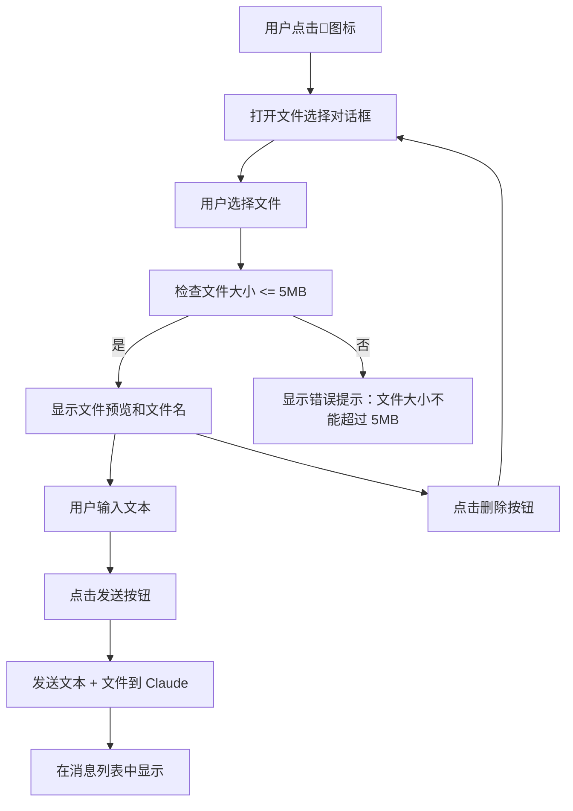

# RQ-022：在发送区域增加选择本地文件发送的功能

---

## 需求概述

**问题分析**：当前 Context Lab 只支持纯文本输入，无法发送文件，这限制了智能体处理包含图片、文档等视觉/结构化信息的任务的能力。

**需求描述**：在发送区域增加选择本地文件发送的功能，使用户可以与文本一起发送文件内容。

---

## 核心功能

### 1. 文件选择

#### 触发方式
- **点击选择**：在发送区域添加 📎 图标按钮，点击打开文件选择对话框
- **交互反馈**：悬停时图标颜色变为蓝色，点击有按压反馈

#### 文件限制
- **类型**：所有文件类型
- **大小**：单个文件 ≤ 5MB
- **数量**：一次只能选择一个文件

### 2. 文件预览

#### 图片预览
- 选择图片文件时，在输入框旁显示缩略图预览
- 支持常见图片格式：PNG、JPG、GIF、WEBP 等
- 缩略图尺寸：32×32px

#### 文件信息显示
- 显示文件名（截断到 20 字符）
- 显示文件大小（格式：XX KB/MB）
- 显示删除按钮（✕），点击可取消选择

### 3. 文件发送

#### 发送方式
- 选择文件后，点击发送按钮会一起发送文本和文件
- 文件作为消息的附件发送

#### 消息显示
- 文件在消息列表中显示为卡片形式
- 图片显示缩略图
- 文档显示图标和文件名

---

## UI 设计

### 发送区域布局

**设计方案一（推荐）**：发送按钮旁的图标按钮

```
┌───────────────────────────────────────────────────────────┐
│ 场景选择器 │ 工具选择栏 │ 文本输入框 │ 📎 │ 发送按钮 │
└───────────────────────────────────────────────────────────┘
```

**详细样式规范**：

```css
/* 文件选择按钮 */
.file-upload-button {
  padding: 8px 12px;
  background: var(--bg-surface);
  border: 1px solid var(--border-default);
  border-radius: 8px;
  cursor: pointer;
  display: flex;
  align-items: center;
  gap: 6px;
  transition: all 0.15s;
  white-space: nowrap;
  height: 44px; /* 与输入框高度一致 */
}

.file-upload-button:hover {
  background: var(--bg-hover);
  border-color: var(--accent-blue);
}

.file-upload-button:active {
  transform: scale(0.98);
}

/* 文件预览 */
.file-preview {
  display: flex;
  align-items: center;
  gap: 6px;
  margin-top: 8px;
  padding: 6px 10px;
  background: var(--bg-elevated);
  border-radius: 6px;
  font-size: 13px;
}

.file-preview img {
  width: 24px;
  height: 24px;
  object-fit: cover;
  border-radius: 4px;
}

.file-preview span {
  color: var(--text-secondary);
  overflow: hidden;
  text-overflow: ellipsis;
  white-space: nowrap;
  max-width: 150px;
}

.file-remove-button {
  background: none;
  border: none;
  color: var(--text-tertiary);
  cursor: pointer;
  font-size: 16px;
  padding: 0;
  width: 20px;
  height: 20px;
  display: flex;
  align-items: center;
  justify-content: center;
  border-radius: 4px;
  transition: all 0.1s;
}

.file-remove-button:hover {
  background: var(--bg-hover);
  color: var(--accent-red);
}
```

---

## 交互流程



---

## 技术实现

### 1. 类型定义更新

**文件路径**：`src/types/index.ts`

```typescript
// 新增类型
export interface FileAttachment {
  name: string;
  type: string;
  size: number;
  url: string; // 本地预览 URL
  content: string; // base64 内容
}

// 更新 Message 类型
export interface Message {
  role: 'user' | 'assistant';
  content: string;
  files?: FileAttachment[];
  timestamp: string;
}
```

### 2. ChatInteraction.tsx 更新

**状态管理**：

```typescript
const [selectedFile, setSelectedFile] = useState<File | null>(null);
const [filePreviewUrl, setFilePreviewUrl] = useState<string | null>(null);
```

**文件处理函数**：

```typescript
const handleFileSelect = (event: React.ChangeEvent<HTMLInputElement>) => {
  const file = event.target.files?.[0];
  if (file) {
    if (file.size > 5 * 1024 * 1024) {
      alert('文件大小不能超过 5MB');
      return;
    }
    setSelectedFile(file);
    // 生成预览 URL
    const url = URL.createObjectURL(file);
    setFilePreviewUrl(url);
  }
};

const handleRemoveFile = () => {
  if (filePreviewUrl) {
    URL.revokeObjectURL(filePreviewUrl);
    setFilePreviewUrl(null);
  }
  setSelectedFile(null);
};

const convertFileToBase64 = (file: File): Promise<string> => {
  return new Promise((resolve, reject) => {
    const reader = new FileReader();
    reader.onload = (e) => resolve(e.target?.result as string);
    reader.onerror = reject;
    reader.readAsDataURL(file);
  });
};
```

**渲染部分**：

```typescript
return (
  <div style={{ display: 'flex', alignItems: 'flex-end', gap: '8px' }}>
    {/* 场景选择器 */}
    <div ref={sceneRef} style={{ position: 'relative' }}>
      {/* 场景选择器代码 */}
    </div>

    <ToolSelectorBar />

    <div style={{ flex: 1, position: 'relative' }}>
      <textarea
        // 现有属性...
      />
      <button
        onClick={handleSend}
        // 现有属性...
      >
        <svg width="15" height="15" viewBox="0 0 24 24" fill="none" stroke="currentColor" strokeWidth="2.5">
          <path d="M22 2L11 13M22 2l-7 20-4-9-9-4 20-7z" />
        </svg>
      </button>
    </div>

    {/* 文件选择按钮 */}
    <div style={{ position: 'relative' }}>
      <input
        type="file"
        id="file-upload"
        onChange={handleFileSelect}
        style={{ display: 'none' }}
      />
      <button
        onClick={() => document.getElementById('file-upload')?.click()}
        style={{
          padding: selectedFile ? '6px 8px' : '8px 12px',
          background: selectedFile ? 'var(--accent-amber)' : 'var(--bg-surface)',
          border: '1px solid var(--border-default)',
          borderRadius: '8px',
          cursor: 'pointer',
          display: 'flex',
          alignItems: 'center',
          gap: selectedFile ? '4px' : '6px',
          transition: 'all 0.15s',
          height: '44px',
          minWidth: selectedFile ? 'auto' : '44px',
        }}
        title="选择文件"
        disabled={isLoading}
      >
        {filePreviewUrl && selectedFile?.type.startsWith('image/') ? (
          
        ) : (
          '📎'
        )}
        {selectedFile && (
          <>
            <span style={{ fontSize: '12px', color: 'var(--text-secondary)', maxWidth: '120px', overflow: 'hidden', textOverflow: 'ellipsis', whiteSpace: 'nowrap' }}>
              {selectedFile.name}
            </span>
            <button
              onClick={(e) => { e.stopPropagation(); handleRemoveFile(); }}
              style={{
                background: 'none',
                border: 'none',
                color: 'var(--text-tertiary)',
                cursor: 'pointer',
                fontSize: '16px',
                padding: '0',
                width: '16px',
                height: '16px',
                display: 'flex',
                alignItems: 'center',
                justifyContent: 'center',
              }}
            >
              ✕
            </button>
          </>
        )}
      </button>
    </div>

    {/* 发送按钮 */}
    {/* 发送按钮代码 */}
  </div>
);
```

### 3. Agent 服务更新

**文件路径**：`src/services/agentService.ts`

```typescript
interface ClaudeMessage {
  role: 'user' | 'assistant';
  content: string | Array<{ 
    type: 'text' | 'tool_use' | 'tool_result' | 'image' | 'file'; 
    [key: string]: any 
  }>;
}

// 更新 sendMessage 方法
async sendMessage(
  message: string,
  systemPrompt: string,
  tools?: string[],
  contextStrategy?: ContextStrategy,
  files?: FileAttachment[]
): Promise<string> {
  // ... 现有逻辑
  
  // 构建消息内容
  let content: string | Array<any> = message;
  
  if (files && files.length > 0) {
    content = [
      { type: 'text', text: message },
      ...files.map(file => {
        if (file.type.startsWith('image/')) {
          return {
            type: 'image',
            source: {
              type: 'base64',
              media_type: file.type,
              data: file.content.split(',')[1] // 去除 data URL 前缀
            }
          };
        } else {
          // 对于非图片文件，目前只发送文件名信息
          return {
            type: 'text',
            text: `\n[附件: ${file.name}] (${(file.size / 1024).toFixed(1)}KB)`
          };
        }
      })
    ];
  }
  
  // ... 发送到 Claude API 的逻辑
}
```

---

## 验证要点

### 功能验证

1. **文件选择**：点击📎图标能打开文件选择对话框
2. **文件限制**：
   - 拒绝大于 5MB 的文件
   - 接受所有文件类型
   - 一次只能选择一个文件
3. **文件预览**：图片文件显示缩略图
4. **文件删除**：点击删除按钮能取消选择
5. **发送功能**：文件和文本能一起发送
6. **消息显示**：文件在消息列表中正确显示

### 边界情况

1. **无文件时**：UI 显示正常，无异常行为
2. **加载状态**：文件选择按钮在发送中应该禁用
3. **错误处理**：处理文件读取错误
4. **资源清理**：选择新文件时应该释放旧文件的 URL

---

## 设计理念合规检查

### 极简原则（Simplicity）
- 功能聚焦：只提供文件选择和删除功能
- 视觉简洁：使用小图标，不分散注意力
- 布局稳定：不改变主要发送区域布局

### 专注原则（Focus）
- 一次只提供一个核心操作：文件选择
- 视觉层次清晰：按钮状态明确
- 反馈即时：悬停和点击效果明显

### 直觉原则（Intuition）
- 图标熟悉：📎 是常见的附件图标
- 操作直接：点击 → 选择 → 发送
- 状态可见：选择后立即显示文件信息

### 一致性原则（Consistency）
- 使用项目的设计系统（CSS 变量）
- 交互模式一致：悬停、点击效果与现有组件相同
- 布局对齐：按钮高度与输入框一致

---

## 待解决的问题

### 文件类型支持
- 对于非图片文件，目前只发送文件名信息
- 需要进一步确定如何处理文档和其他文件类型

### API 兼容性
- 需要确认 Claude API 对文件类型的支持程度
- 可能需要调整文件内容的处理方式

---

**文档版本**：1.0  
**最后更新**：2026-05-17  
**状态**：待审查
